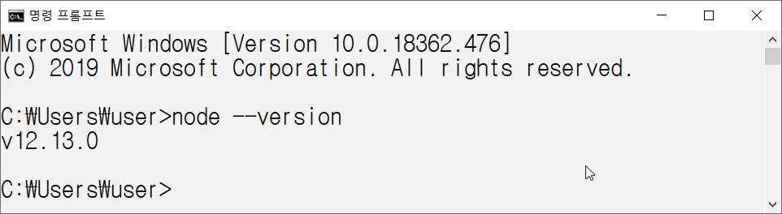
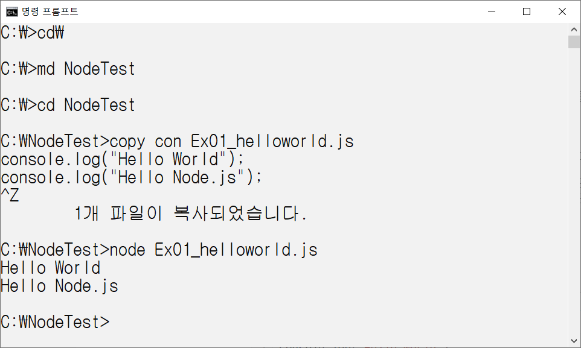
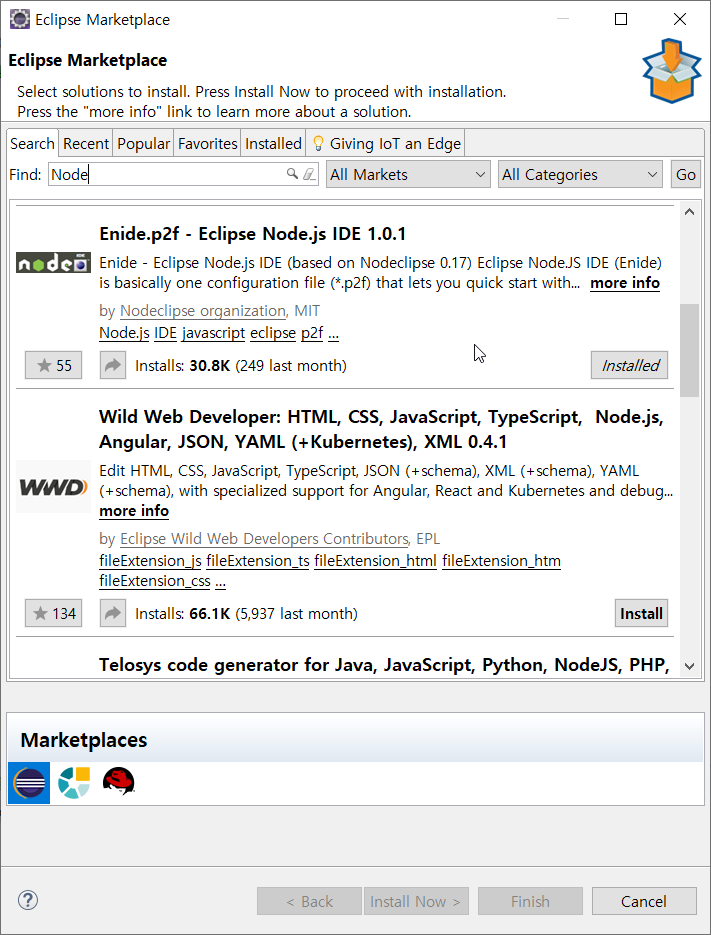
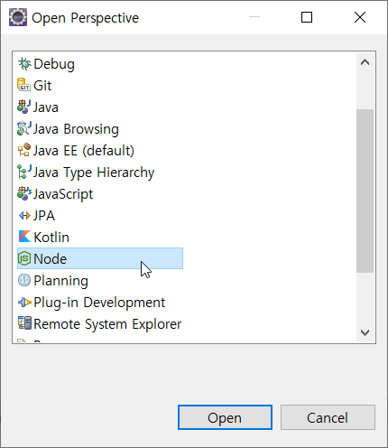
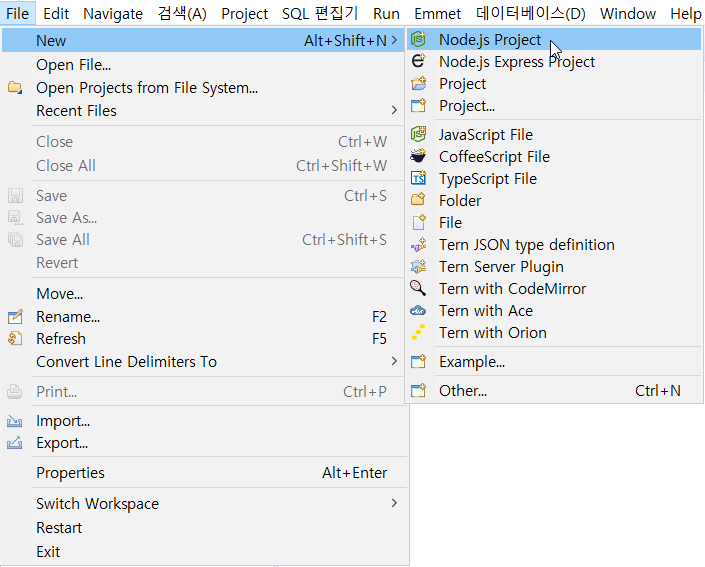
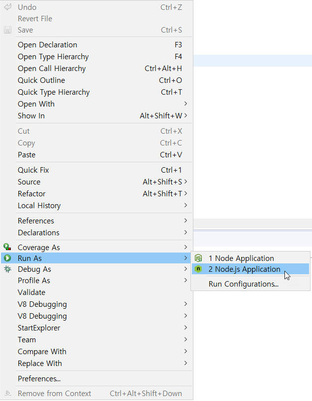
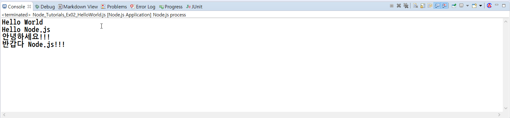
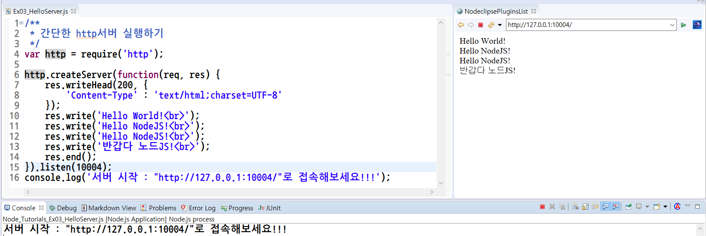

# Node_Tutorials

### 첫번째 예제

Node.js 공식 홈페이지(https://nodejs.org/ko/)에서 Node.js를 다운받을 수 있습니다.
Current : 최신 버전
LTS : 안정 버전
Current는 최신 버전이므로, 버그가 있을 수 있으므로 안정버전인 LTS를 다운 받으시는것을 권장합니다.


설치가 완료되면 커맨더 창에서 아래의 명령어를 실행하여 노드가 잘 설치되었는지 확인합니다.

자신이 사용하는 편집기를 이용하며 다음과 같이 Ex01_helloworld.js 파일을 만듭니다.

```js
console.log("Hello World");
console.log("Hello Node.js");
```

커맨더 창에서 아래의 명령어를 실행하여 작성한 파일을 실행하여 실행 결과를 확인합니다. 


### Eclipse에서 Node Project 생성하기

1. Marketplace에서 node를 검색하여 Eclipse Node.js IDE를 설치 합니다.

2. 퍼스펙티브를  Node로 변경합니다. 

    

3.  Node Project를 생성합니다.

    

4.  다음의 파일을 생성합니다.(Ex02_HelloWorld.js)

```js
/**
 * Hello World 출력!!!!
 */
console.log("Hello World");
console.log("Hello Node.js");
console.log("안녕하세요!!!");
console.log("반갑다 Node.js!!!");
```

5.  작성한 파일 위에서 마우스 우측번튼을 눌러 파일을 실행 합니다. 
6.  다음의 결과를 확인 합니다. 


### 간단한 http서버 만들어 실행해 보기

1. 다음의 소스를 Ex03_HelloServer.js파일로 작성한다.

```js
/**
 * 간단한 http서버 실행하기
 */
var http = require('http');

http.createServer(function(req, res) {
	res.writeHead(200, {
		'Content-Type' : 'text/html;charset=UTF-8'
	});
	res.write('Hello World!<br>');
	res.write('Hello NodeJS!<br>');
	res.write('Hello NodeJS!<br>');
	res.write('반갑다 노드JS!<br>');
	res.end();
}).listen(10004);
console.log('서버 시작 : "http://127.0.0.1:10004/"로 접속해보세요!!!');
```

2.  위의 파일을 실행하고 웹 브라우져를 실행하여 "http://127.0.0.1:10004/"로 접속하면 다음의 결과를 얻을 수 있습니다. 


이제 Node.js를 배울 준비가 모두 끝났습니다. 이제 하나 하나씩 배워보도록 하겠습니다.


