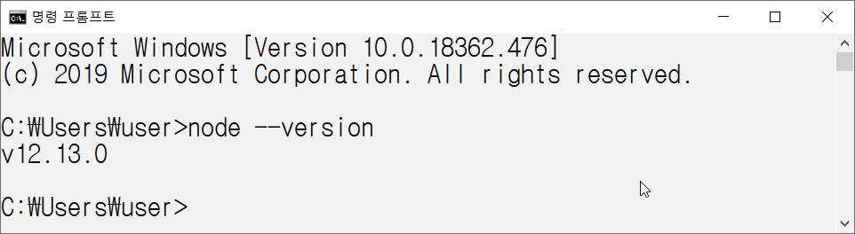
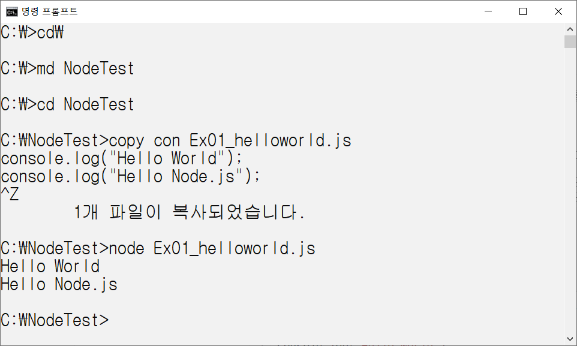

# Node_Tutorials

### 첫번째 예제

Node.js 공식 홈페이지(https://nodejs.org/ko/)에서 Node.js를 다운받을 수 있습니다.
Current : 최신 버전
LTS : 안정 버전
Current는 최신 버전이므로, 버그가 있을 수 있으므로 안정버전인 LTS를 다운 받으시는것을 권장합니다.


설치가 완료되면 커맨더 창에서 아래의 명령어를 실행하여 노드가 잘 설치되었는지 확인합니다.

자신이 사용하는 편집기를 이용하며 다음과 같이 Ex01_helloworld.js 파일을 만듭니다.

```js
console.log("Hello World");
console.log("Hello Node.js");
```

커맨더 창에서 아래의 명령어를 실행하여 작성한 파일을 실행하여 실행 결과를 확인합니다. 


